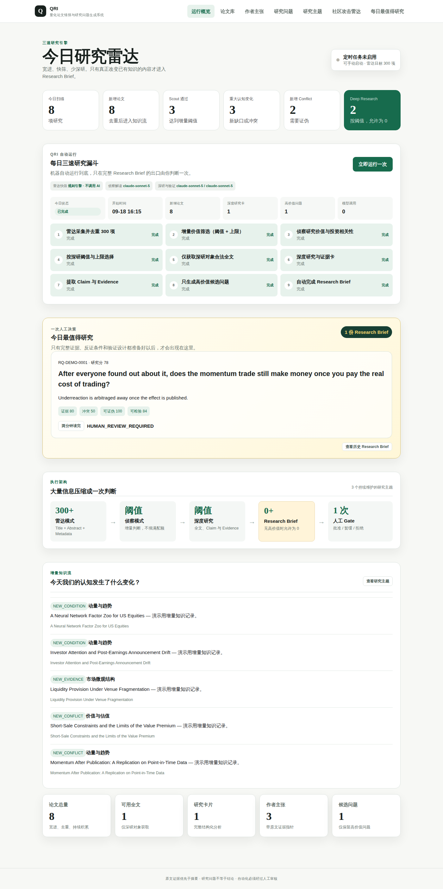
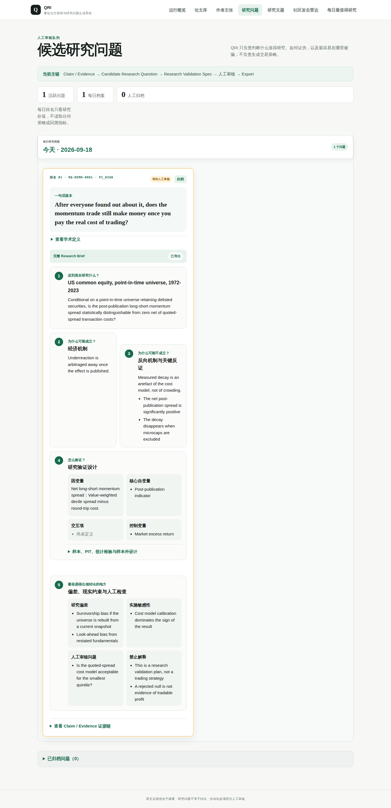
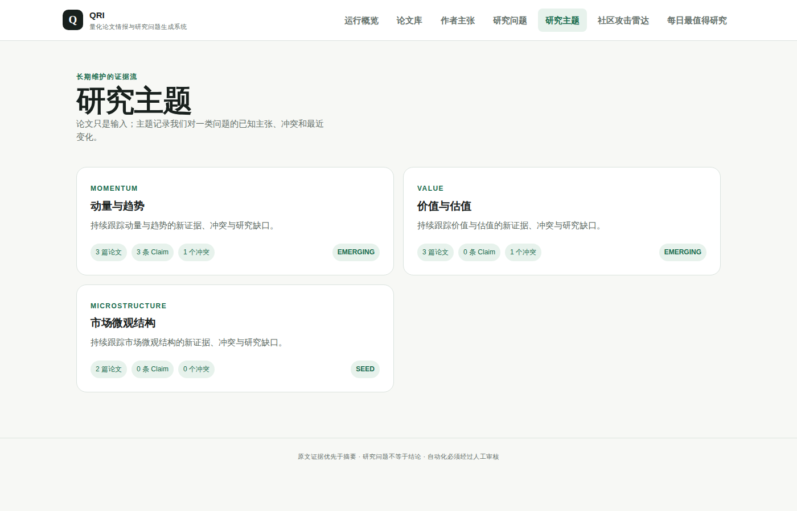
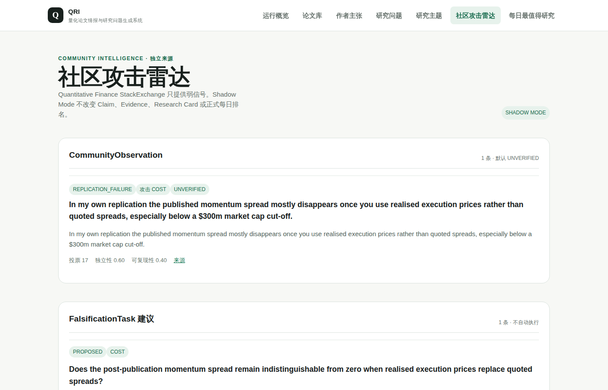

# QRI — Quant Research Intelligence

**把海量量化论文压缩成少数几个可证伪的研究问题，每个都带着原文证据。**

[English](README.md) · [贡献指南](CONTRIBUTING.md) · MIT License

QRI 每天扫描约 300 篇论文，压缩成少量值得人工决策的 Research Brief。它回答三个
问题：什么值得研究、为什么值得研究、什么结果能推翻它 —— 然后就停在这里。它不生成
可交易策略，不决定仓位，也不把统计检验包装成投资建议。



*每日雷达：演示数据中扫描 8 篇，3 篇进入侦察，2 篇进入深度研究，1 份 Research
Brief 等待人工决策。*

## 60 秒看到效果

不需要 PostgreSQL、不需要 API key、不需要联网。演示数据是合成的 —— 论文、作者和
数字都是虚构的 —— 但它走的是和真实运行完全相同的代码路径。

```bash
python -m venv .venv && source .venv/bin/activate   # Windows: .venv\Scripts\Activate.ps1
pip install -e ".[dev]"
alembic upgrade head
qri demo
uvicorn app.main:app --reload
```

然后打开 <http://127.0.0.1:8000/dashboard>。

> Web 界面监听 localhost 且**没有任何鉴权**。部分端点会产生模型调用费用并启动后台
> 进程，请不要把端口暴露到不受信任的网络。

## 它和别的工具有什么不同

多数文献工具做的是摘要。QRI 建立在四条**写进代码、而不是只写进 README** 的约束上：

**证据优先于摘要。** Research Card 的字段若没有在解析后的全文中逐字命中的引文，
就是 `UNVERIFIED`。定位器会把每条引文解析到页码和字符偏移，并交叉校验页内偏移与
全文偏移是否一致；对不上的引文直接抛错，而不是存下来。见
[`app/evidence/locator.py`](app/evidence/locator.py)。

**问题优先于结论。** 作者的论断记录为 `AUTHOR_CLAIM`，永远不是系统事实。每一份
抽取提示词都写明了这一点。

**证伪优先。** 一份 Research Brief 必须说明什么结果会推翻假设、有哪些偏差风险、
最低数据需求是什么，否则就是不完整的。

**统计检验不等于策略。** 回归、组合排序、安慰剂和样本外检验都是研究工具。任何内容
进入下游系统之前都必须经过人工批准 —— `export_candidate_question()` 会拒绝一切
非 `HUMAN_APPROVED` 的问题。



## 三速漏斗

```text
每天扫描约 300 篇论文
  → 雷达模式  Title + Abstract + Metadata，关键词启发式，不调用 AI
  → 侦察模式  超过增量价值阈值、受上限限制，做摘要级解读
  → 深度研究  超过深研阈值、受上限限制，允许为 0
  → Research Brief：问题、反证与验证方案
  → 一次人工 Gate：批准 / 暂缓 / 拒绝
```

这些是**带上限的阈值，不是必须填满的配额**。没有候选达到门槛时，仪表盘会明确显示
"今日无高价值新增研究问题"，而不是硬凑一份日报。

**雷达模式**是刻意做得很便宜的第一层：基于标题和摘要的关键词与 Jaccard 相似度启发
式，不调用任何模型。分数只用于排序，不代表置信度。`LOW_INCREMENTAL_VALUE` 和
`NO_MATERIAL_CHANGE` 直接归档，不获取全文。

**侦察模式**只处理过阈值的项目，回答"它改变了我们已经知道的什么"。

**深度研究模式**只为过深研阈值的少数论文获取合法全文，然后生成 Research Card、
Claim、Evidence Pointer、候选研究问题和验证方案。

## 主题驱动，而不是逐篇处理

运行单位是 `ResearchTheme → Evidence Stream → Research Question`，因此系统跟踪的是
"变化了什么"，而不是每天早上把动量文献重读一遍。每篇论文都会归入主题并标记为
`NO_MATERIAL_CHANGE`、`LOW_INCREMENTAL_VALUE`、`NEW_CONDITION`、`NEW_EVIDENCE`
或 `NEW_CONFLICT`，每次运行都会留下 `KnowledgeDelta`。



## 社区攻击雷达（Shadow Mode）

一个独立的 provider 读取 Quantitative Finance StackExchange 官方 API，寻找"已发表
结论在真实实现中站不住"的弱信号。论坛正文全程按 `UNTRUSTED_EXTERNAL_CONTENT`
处理：不执行其中代码、不跟随外链、不进入 Claim / Evidence、不改变每日排名。它只能
产生默认 `UNVERIFIED` 的 `CommunityObservation`，并提出待人工审核的
`FalsificationTask`。



## 论文来源

发现层聚合 arXiv、OpenAlex、Crossref 和 Semantic Scholar，并用 Unpaywall 补充合法
开放全文。单一来源失败不会阻断其他来源。仅有摘要的记录明确标记为 `ABSTRACT_ONLY`，
不会声称已经读取全文。

## 正式运行

需要 Python 3.12+。复制 `.env.example` 为 `.env`，配置数据库和 OpenAI 兼容的模型
接口。

```bash
docker compose up -d postgres      # 或把 DATABASE_URL 指向你自己的库
alembic upgrade head
uvicorn app.main:app --reload
```

### 主要页面

| 路径 | 内容 |
| --- | --- |
| `/dashboard` | 今日研究雷达、漏斗进度与出口决策 |
| `/papers` | 论文库 |
| `/claims` | 作者主张与原文证据 |
| `/questions` | 完整 Research Brief |
| `/daily-best` | Research Brief 历史归档 |
| `/themes` | 长期维护的研究主题与 Knowledge Delta |
| `/community-attack-radar` | 社区弱信号与证伪任务（Shadow Mode） |

### 命令行

```bash
qri demo                                 # 合成数据集，无需联网
qri daily --target 300
qri radar --scout-max 30 --threshold 0.48
qri briefs --top 30
qri prioritize --deep 5 --threshold 0.62
qri fetch --top 3
qri analyze --top 3
qri claims --top 3
qri questions
qri validation-briefs --top 3
qri community-shadow --query "momentum transaction cost replication"
```

`qri daily-funnel` 按顺序运行上述阶段，并支持从失败阶段恢复。

### 配置

```env
PRIMARY_MODEL=claude-sonnet-5       # 侦察与论文分析
REASONING_MODEL=claude-sonnet-5     # 问题生成
VALIDATION_MODEL=claude-sonnet-5    # 研究验证方案
```

任何你的 OpenAI 兼容网关支持的模型 ID 都可以。雷达快筛完全不调用模型。

漏斗控制项都是阈值和安全上限，不是必须填满的数量：

```env
SCOUT_SCORE_THRESHOLD=0.48
SCOUT_MAX_ITEMS=30
DEEP_RESEARCH_THRESHOLD=0.62
DEEP_RESEARCH_MAX_ITEMS=5
DAILY_SCAN_TARGET=300
COMMUNITY_SHADOW_ENABLED=true
```

模型调用会记录到 `ai_calls` 审计表。QRI 不内置任何厂商价目表，配置你自己的费率即可
同时得到成本：

```env
INPUT_COST_PER_MILLION_TOKENS=0
OUTPUT_COST_PER_MILLION_TOKENS=0
```

## 开发

```bash
pytest -q        # 测试
ruff check .     # lint
mypy app         # 类型检查
```

CI 还会运行迁移链（upgrade、schema 与模型一致性检查、幂等重跑、downgrade 到 base、
再 upgrade）、在 PostgreSQL 上跑完整测试套件，以及新用户会走的 demo 路径。

目录结构：

```text
app/web/         HTTP 路由，每个界面区域一个模块
app/radar/       增量价值分流
app/evidence/    原文引用逐字锚定
app/question_factory/  候选问题与导出 Gate
app/providers/   论文来源、社区来源、模型网关
app/demo/        `qri demo` 背后的合成数据集
```

界面目前只有中文；代码、测试和配置是英文。把模板翻译成英文是一个很好的首次贡献。

## 范围与边界

QRI 目前是可运行的早期版本。它的产出是**可审计的研究线索和验证说明 —— 不是投资
建议、交易信号或任何收益承诺**。它不连接券商、不下单，也不会把统计检验自动包装成
可交易策略。任何进入下游系统的内容都必须先过人工审核。

早期版本的策略孵化与快速回测保留为 `/legacy-strategies` 下的只读归档。所有写入路径
均已停用并返回 410；这些记录不参与雷达、排名、审核或导出。

贡献流程、安全问题上报和行为准则分别见 [CONTRIBUTING.md](CONTRIBUTING.md)、
[SECURITY.md](SECURITY.md)、[CODE_OF_CONDUCT.md](CODE_OF_CONDUCT.md)。
